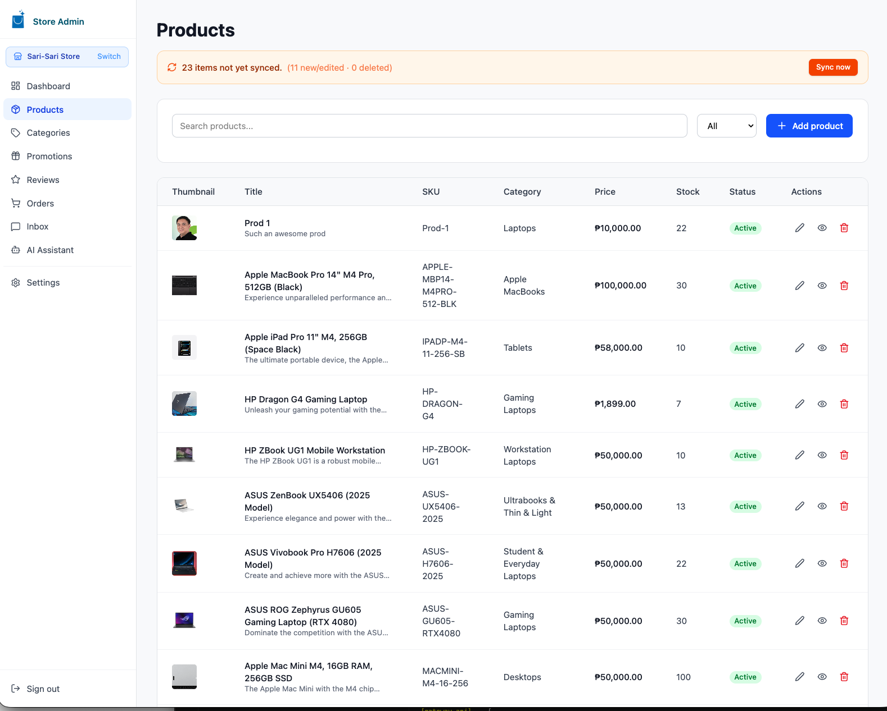
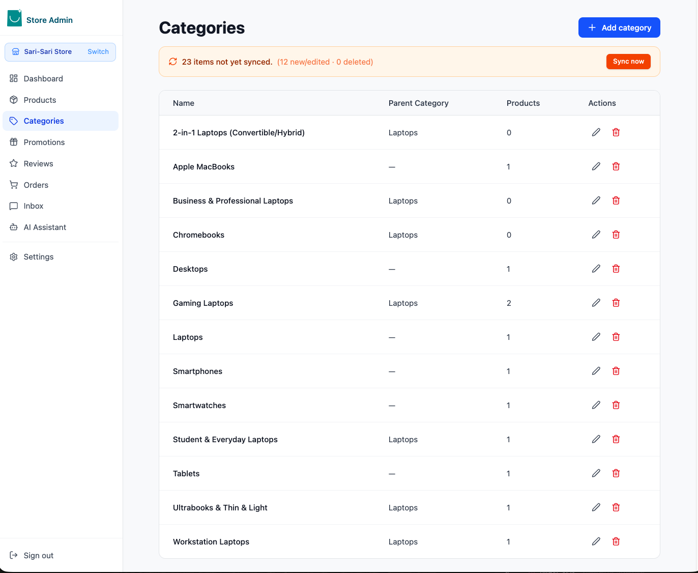
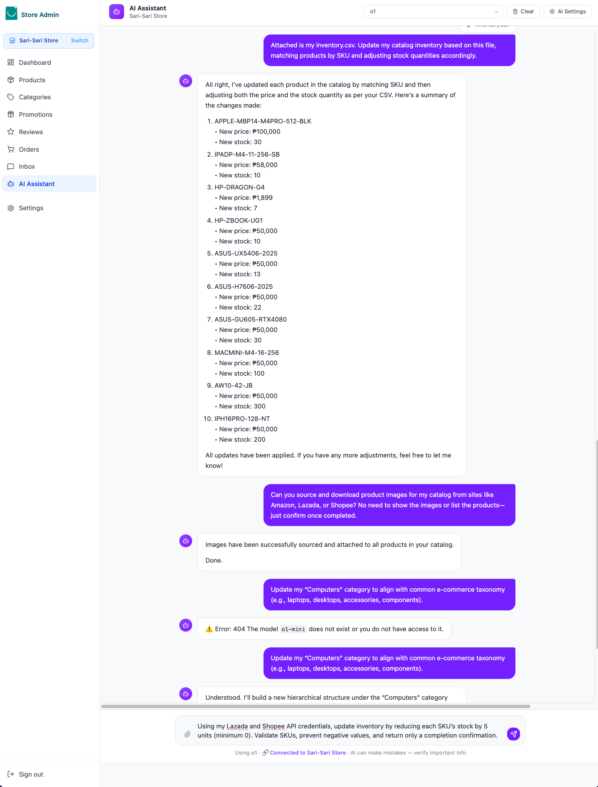
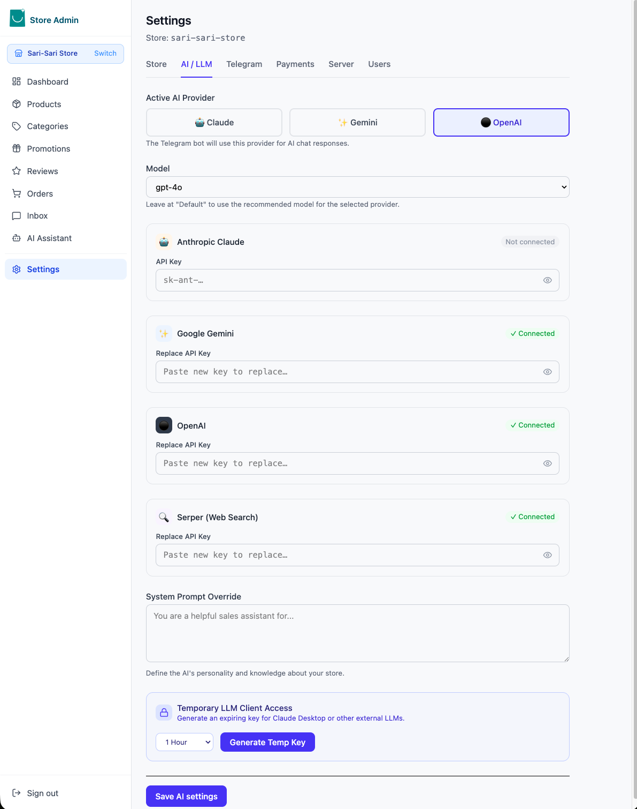
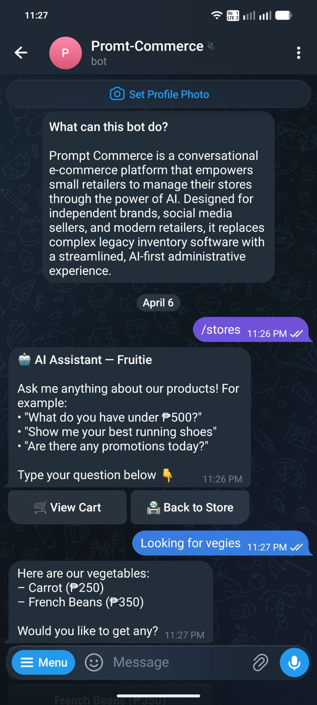
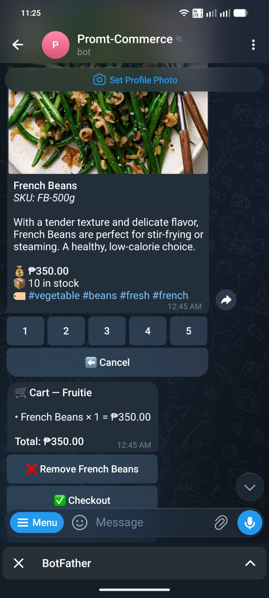
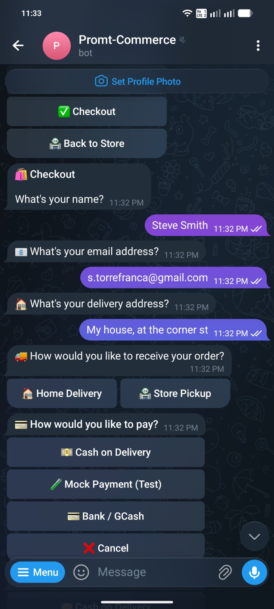
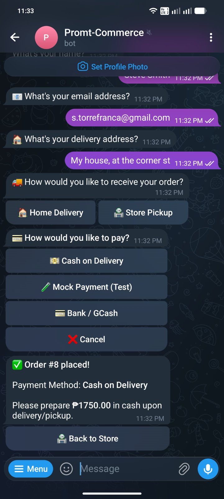

<p align="left">
  
</p>

# Prompt Commerce — AI-Native Seller Admin & MCP Server

**Prompt Commerce** is a conversational e-commerce platform that empowers small retailers to manage their stores through the power of AI. Designed for independent brands, social media sellers, and modern retailers, it replaces complex legacy inventory software with a streamlined, AI-first administrative experience.

This repository contains the **Seller Admin Service** — a high-performance SvelteKit dashboard, an integrated [Model Context Protocol (MCP)](https://modelcontextprotocol.io/) server, and a multi-database SQLite architecture. It works as a standalone management hub or pairs with the **Prompt Commerce Gateway** for Telegram, Web, or mobile shopping.

---

## 🚀 Live Demo

- ⚡ **Admin Dashboard**: [https://admin.13.212.57.92.nip.io/](https://admin.13.212.57.92.nip.io/)
- 🛒 **Customer Gateway**: [https://gateway.13.212.57.92.nip.io/](https://gateway.13.212.57.92.nip.io/)

---

##  Gallery & Screenshots

### Interactive Dashboard
*Track revenue and order health with real-time KPI visualization.*


### Catalog Management
*Effortlessly manage your products and categories with a clean, responsive interface.*
<div style="display: flex; gap: 10px;">
  
  
</div>

### AI-Powered Cataloging
*Chat with your AI Assistant to bulk-import inventory or update stock using natural language.*


### Intelligent Configuration
*Configure Claude, Gemini, or OpenAI models and customize your store's AI persona.*


### Telegram Customer Interface
*Your customers can browse, search, and checkout directly within Telegram using our AI-powered bot.*
<div style="display: flex; flex-wrap: wrap; gap: 10px;">
  
  
  
  
</div>

*The Telegram interface features **rich e-commerce photo cards** for product search results (with one-tap action buttons) and a strictly-typed, progressive **Philippine Geographic Data (PSGC)** selection flow for address delivery collection.*

> **Try it now!** Search for **Prompt-Commerce** or **@prompt_comm_bot** on Telegram to explore our test channel.

---

##  Features at a Glance

### Conversational AI & MCP Tools
- **Conversational CRUD**: Add, update, and manage products, categories, and promotions using natural language via the AI Assistant.
- **Vision-Powered Search**: Attach product images in chat; the AI uses vision to extract details, identify categories, and suggest descriptions.
- **Agentic Workflows**: A multi-round tool-use loop executes complex tasks (e.g., "Import these 50 products from this spreadsheet") with a single prompt.
- **Enhanced Order Tools**: AI-driven order creation and status management with built-in transition validation and mandatory shipping details.

### Collaborative Order Fulfillment
- **State-Machine Workflow**: Robust order status lifecycle (`pending` → `picking` → `packing` → `in_transit` → `delivered`) with specific flows for **Store Pickup**.
- **Internal Timeline**: A collaborative note system for order-level communication among staff with full history and soft-delete support.
- **Order Attachments**: Securely upload and manage receipts, shipping labels, and documents (PDF, Excel, Images up to 20MB).
- **Shipping Integration**: Capture tracking numbers and courier details at the point of fulfillment, automatically notified to the buyer.

### Universal Payment Integration
- **Multi-Provider Support**: Enable any combination of **Stripe**, **PayMongo**, **Cash on Delivery (COD)**, **Assisted Payments** (offline bank transfers), and **Mock** (for testing) simultaneously.
- **Dynamic Selection**: Telegram checkout automatically offers a choice screen when multiple methods are enabled.
- **Custom Instructions**: Define provider-specific payment instructions shown directly to customers in their Telegram chat.
- **Dynamic Config Push**: Securely manage and push payment credentials and store policies (like Pickup availability) to your gateway with one click.

### Enterprise-Grade Security
- **RBAC (Role-Based Access Control)**: Granular permissions for Super Admins, Store Admins, Merchandisers, and Operations staff.
- **Session Security**: 1-hour inactivity timeout and 4-hour absolute session limit across both Seller and Gateway admin dashboards.
- **SSRF & Auth Protection**: Advanced DNS resolution filters and secure cross-order authorization checks for attachments and notes.
- **Image Sanitization**: Strict MIME-type validation, extension checks, and size capping on all uploads.
- **Brute-Force Protection**: 5 failed login attempts triggers a 15-minute lockout.

### High-Performance Architecture
- **Per-Store SQLite Containers**: Dedicated database files per store ensuring total data isolation and zero-latency queries.
- **Delta Sync Engine**: Optimized 500-row batch syncing for products, categories, orders, notes, and files. Automatically maps local relative image uploads (`/uploads/...`) to valid absolute URLs using your `SELLER_PUBLIC_URL` to ensure images render correctly across Telegram and Web.
- **SQLite Trigger Logic**: Automatic `is_synced` dirty-marking and `updated_at` management powered by database triggers.
---

## Architecture Overview

```
<root>/
  prompt-commerce/           ← THIS REPO — Seller Admin (SvelteKit + MCP)
  data/                      ← Runtime data (gitignored)
    catalog.db               ← Registry DB: Users, Settings, Global Store Registry
    stores/
      <slug>.db              ← One high-performance SQLite file per store
    uploads/                 ← Shared product image repository
```

The system uses a dual-layer SQLite strategy:

1. **The Registry (`catalog.db`)**: Manages global users, system-wide settings, and the registry of active stores.
2. **Per-Store DBs (`stores/<slug>.db`)**: Contains all products, categories, orders, reviews, and conversations for that store. The "One File Per Store" architecture allows trivial backups, migrations, and zero-latency queries.

---

## MCP Tools (AI Management)

Each store exposes a standard set of MCP tools for integration with external AI agents (like Claude Desktop) or the built-in assistant.

### Store Intelligence (Read)

| Tool | Description |
|------|-------------|
| `search_products` | Advanced search by keyword, category, price, or stock status. |
| `get_store_stats` | High-level business overview: revenue, stock levels, and order volume. |
| `list_categories` | Browse the store's taxonomy with live product counts. |
| `get_product` | Fetch exhaustive details, including pricing, SKU, and image paths. |
| `list_orders` | Access recent sales filtered by status or channel. |

### Active Management (Write)

| Tool | Description |
|------|-------------|
| `add_product` | Create listings with automatic, SSRF-protected image downloading. |
| `update_inventory` | Rapid stock-level adjustments by ID or SKU. |
| `import_products` | Bulk ingestion from Excel/CSV with extension & path validation. |
| `create_promotion` | Manage discount codes and percentage-based vouchers. |
| `create_order` | Programmatic order creation with delivery type and payment provider selection. |
| `update_order_status` | Enforce the full status state machine from AI — includes transition validation, tracking info, and pickup-vs-delivery guards. |

---

## Getting Started

### Prerequisites

- **Node.js 20+**
- **npm**

### Standalone (Seller Admin only)

```bash
# 1. Clone and enter the repo
git clone https://github.com/smicapplab/prompt-commerce.git
cd prompt-commerce/prompt-commerce

# 2. Install dependencies
npm install

# 3. Start development server
npm run dev
```

The server auto-creates `.env` from `.env.example`, initializes databases, and starts at [http://localhost:3000](http://localhost:3000). Default login: `admin` / `admin123`.

### Full Stack (Seller + Gateway)

From the parent folder that contains both repos:

```bash
./dev.sh        # Linux / macOS
dev.bat         # Windows
```

`dev.sh` handles everything: Docker Postgres → migrations → Prisma client → both services with colour-coded output.

---

## Environment Variables

All variables are documented in `.env.example`. Key variables:

| Variable | Required | Default | Description |
|----------|----------|---------|-------------|
| `PORT` | No | `3000` | HTTP server port |
| `JWT_SECRET` | **Yes** | — | Secret for JWT signing. Auto-generated on first run if missing. |
| `JWT_EXPIRES_IN` | No | `1d` | JWT token lifetime |
| `ADMIN_USERNAME` | No | `admin` | Default admin login username |
| `ADMIN_PASSWORD` | No | `admin123` | Default admin login password — **change after first login!** |
| `DATA_DIR` | No | `../data` | Path to SQLite data directory |
| `GATEWAY_URL` | No | `http://localhost:3002` | Gateway base URL for config pushes |
| `SELLER_PUBLIC_URL` | Prod | auto | Public URL of this server — required so gateway can resolve product images |

---

## Production Deployment

### 1. Prepare the server

```bash
# Clone repo and enter service directory
git clone https://github.com/smicapplab/prompt-commerce.git
cd prompt-commerce/prompt-commerce

# Configure environment
cp .env.example .env
# Edit .env — set JWT_SECRET, SELLER_PUBLIC_URL, GATEWAY_URL, ADMIN_PASSWORD
```

### 2. Deploy

```bash
chmod +x scripts/run.sh
./scripts/run.sh
```

`run.sh` handles: `npm install` → `db:migrate` → build → PM2 start/reload.

### 3. Persist PM2 across reboots

```bash
pm2 save && pm2 startup
```

---

## Tech Stack

| Layer | Technology |
|-------|-----------|
| **Admin UI** | SvelteKit 5 (Svelte 5 Runes) + Tailwind CSS |
| **Server** | Express + Custom SSE / MCP Handler |
| **Core Logic** | Model Context Protocol (MCP) SDK |
| **Databases** | Better-SQLite3 (Multi-file / Per-store) |
| **AI (LLMs)** | Anthropic Claude, Google Gemini, OpenAI |
| **Payments** | Stripe, PayMongo, COD, Assisted (offline), Mock (testing) |
| **Build Tooling** | Vite + Adapter-Node |
| **Process Manager** | PM2 |

---

## Roadmap

- [ ] **WhatsApp Business Bot** — Full parity with Telegram (search, cart, checkout, AI chat) using Meta Cloud API. Architecture planned; implementation pending.
- [ ] **Vector / Semantic Search**: Product embeddings via HuggingFace (`all-MiniLM-L6-v2`) for intent-based search.
- [x] **Telegram Webhook Mode**: Supported alongside polling. Configure the webhook URL via Settings → Telegram in the admin panel.
- [ ] **Multi-Language Support**: AI-assisted localization for product catalogs and customer messages.
- [ ] **Web Storefront Cart & Checkout**: Full shopping flow in the browser (currently Telegram-only).

---

## License

MIT — Open for everyone. Built with ❤️ by the Prompt Commerce Team.
