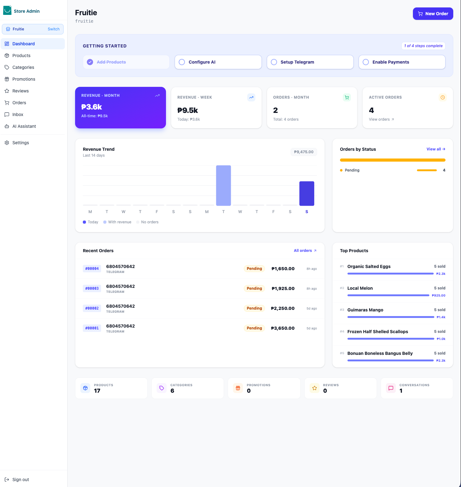

<p align="left">
  
</p>

# Prompt Commerce — AI-Native Seller Admin & MCP Server

**Prompt Commerce** is a state-of-the-art, conversational e-commerce platform that empowers small retailers to manage their stores through the power of AI. Designed for independent brands, social media sellers, and modern retailers, it replaces complex, legacy inventory software with a streamlined, AI-first administrative experience.

This repository contains the **Seller Admin Service**—a high-performance SvelteKit dashboard, an integrated [Model Context Protocol (MCP)](https://modelcontextprotocol.io/) server, and a robust multi-database SQLite architecture. It is designed to work as a standalone management hub or pair with any compatible customer-facing gateway for Telegram, Web, or Mobile shopping.


---

## 🚀 Live Demo

Experience Prompt Commerce in action:
- ⚡ **Admin Dashboard**: [https://admin.13.212.57.92.nip.io/](https://admin.13.212.57.92.nip.io/)
- 🛒 **Customer Gateway**: [https://gateway.13.212.57.92.nip.io/](https://gateway.13.212.57.92.nip.io/)

---


##  Interactive KPI Dashboard
*Manage your business with real-time insights and data-driven clarity.*



- **Live Revenue Analytics**: Track sales performance across daily, weekly, and monthly intervals with instant KPI visualization.
- **Trend Visualization**: Interactive 14-day revenue charts and stacked order-status breakdowns provide a clear view of your store's health.
- **Guided Setup Checklist**: A smart onboarding system that walks new retailers through adding products, configuring AI, and enabling payments.
- **View Public Store**: Instantly preview your store's web presence on the public gateway directly from the Settings panel.
- **Quick Order Actions**: Create, manage, and process orders with a single click directly from the main dashboard.

---

##  Features at a Glance

###  Conversational AI & MCP Tools
- **Conversational CRUD**: Add, update, and manage products, categories, and promotions using natural language via the AI Assistant.
- **Vision-Powered Search**: Attach product images in chat; the AI uses vision to extract details, identify categories, and suggest descriptions.
- **Agentic Workflows**: A multi-round tool-use loop executes complex tasks (e.g., "Import these 50 products from this spreadsheet") with a single prompt.
- **Enhanced Order Tools**: AI-driven order creation and status management with built-in transition validation and mandatory shipping details.

###  Collaborative Order Fulfillment
- **State-Machine Workflow**: Robust order status lifecycle (`pending` → `picking` → `packing` → `in_transit` → `delivered`) with specific flows for **Store Pickup**.
- **Internal Timeline**: A collaborative note system for order-level communication among staff with full history and soft-delete support.
- **Order Attachments**: Securely upload and manage receipts, shipping labels, and documents (PDF, Excel, Images up to 20MB).
- **Shipping Integration**: Capture tracking numbers and courier details at the point of fulfillment, automatically notified to the buyer.

###  Universal Payment Integration
- **Flexible Provider Support**: Built-in adapters for **Stripe**, **PayMongo**, **Cash on Delivery (COD)**, and **Assisted Payments** (offline bank transfers/links).
- **Custom Instructions**: Define provider-specific payment instructions shown directly to customers in their Telegram chat.
- **Dynamic Config Push**: Securely manage and push payment credentials and store policies (like Pickup availability) to your gateway with one click.

###  Enterprise-Grade Security
- **RBAC (Role-Based Access Control)**: Granular permissions for Super Admins, Store Admins, Merchandisers, and Operations staff.
- **SSRF & Auth Protection**: Advanced DNS resolution filters and secure cross-order authorization checks for attachments and notes.
- **Image Sanitization**: Strict MIME-type validation, extension checks, and size capping on all uploads.

###  High-Performance Architecture
- **Per-Store SQLite Containers**: Dedicated database files per store ensuring total data isolation and zero-latency queries.
- **Delta Sync Engine**: Optimized 500-row batch syncing for products, categories, orders, notes, and files to keep customer-facing channels updated.
- **SQLite Trigger Logic**: Automatic `is_synced` dirty-marking and `updated_at` management powered by high-performance database triggers.

---

##  Architecture Overview

```
<root>/
  prompt-commerce/           ← THIS REPO — Seller Admin (SvelteKit + MCP)
  data/                      ← Runtime data (gitignored)
    catalog.db               ← Registry DB: Users, Settings, Global Store Registry
    stores/
      <slug>.db              ← One high-performance SQLite file per store
    uploads/                 ← Shared product image repository
  seller.config.json         ← Simple configuration for gateway & public URLs
```

### Database Strategy

The system utilizes a dual-layer SQLite strategy located in the `data/` directory:

1.  **The Registry (`catalog.db`)**: Manages global users, system-wide settings, and the registry of active stores.
2.  **Per-Store DBs (`stores/<slug>.db`)**: Contains all products, categories, orders, reviews, and conversations specific to that store. This "One File Per Store" architecture allows for trivial backups, migrations, and zero-latency queries.

---

##  MCP Tools (Automated Management)

Each store exposes a standard set of MCP tools for integration with external AI agents (like Claude Desktop) or the built-in assistant.

### Store Intelligence (Read)
| Tool | Description |
|------|-------------|
| `search_products` | Advanced search by keyword, category, price, or stock status. |
| `get_store_stats` | High-level business overview: revenue, stock levels, and order volume. |
| `list_categories` | Browse the store's taxonomy with live product counts. |
| `get_product` | Fetch exhaustive details, including pricing, SKU, and image paths. |
| `list_orders` | Access recent sales filtered by status (`pending_payment`, `pending`, `paid`, `picking`, `packing`, `in_transit`, `ready_for_pickup`, `picked_up`, `delivered`, `cancelled`, `refunded`) or channel. |

### Active Management (Write)
| Tool | Description |
|------|-------------|
| `add_product` | Create listings with automatic, SSRF-protected image downloading. |
| `update_inventory` | Rapid stock-level adjustments by ID or SKU. |
| `import_products` | Bulk ingestion from Excel/CSV with extension & path validation. |
| `create_promotion` | Manage discount codes and percentage-based vouchers. |
| `create_order` | Programmatic order creation with delivery type and payment provider selection. |
| `update_order_status` | Enforce the full status state machine from AI — includes transition validation, tracking info, and pickup-vs-delivery guards. |

---

##  Getting Started

### Prerequisites
- **Node.js 20+**
- **npm** or **yarn**

### 1. Clone the Repository
```bash
git clone https://github.com/smicapplab/prompt-commerce.git
cd prompt-commerce
```

### 2. Install Dependencies
```bash
npm install
```

### 3. Launch Development Server
```bash
npm run dev
```

The system will automatically:
- Create a `.env` file from the example template.
- Generate a secure 64-character JWT secret.
- Initialize the Registry and Store database schemas.
- Start the SvelteKit dashboard on [http://localhost:3000](http://localhost:3000).

---

### 3. Integrated Smart Search
Connected Gateways automatically leverage the high-performance Natural Language search engine for both Telegram and the Web Storefront. This handles complex queries like "laptop under 50k" or "in-stock electronics" with no additional configuration.

---

##  Connecting to a Gateway

To enable customer-facing features like a Telegram bot or a public web storefront, you must connect this admin panel to a compatible Gateway.

1.  Obtain your **Platform Key** from your Gateway administrator.
2.  In the Admin Panel, go to **Stores** → **Add Store**.
3.  Paste the key; the system will automatically fetch metadata and initialize your store DB.
4.  Configure your **Gateway URL** and **Public URL** in `seller.config.json` or through the **Settings → Server** tab.

---

##  Tech Stack

| Layer | Technology |
|-------|-----------|
| **Admin UI** | SvelteKit 5 (Svelte 5 Runes) + Tailwind CSS |
| **Server** | Express + Custom SSE / MCP Handler |
| **Core Logic** | Model Context Protocol (MCP) SDK |
| **Databases** | Better-SQLite3 (Multi-file / Per-store) |
| **AI (LLMs)** | Anthropic Claude, Google Gemini, OpenAI |
| **Payments** | Stripe, PayMongo, COD, Assisted (offline) |
| **Build Tooling** | Vite + Adapter-Node |

---

##  Production Deployment

For production, it is recommended to use a process manager like PM2:

```bash
npm run build
pm2 start ecosystem.config.cjs
pm2 save && pm2 startup
```

Ensure `SELLER_PUBLIC_URL` is set to your production domain so visual assets are served correctly to external gateways.

---

##  Roadmap

- [ ] **Omnichannel Support**: Integration for **WhatsApp**, **Facebook Messenger**, and **Viber**.
- [ ] **Vector / Semantic Search**: Product embeddings via HuggingFace (`all-MiniLM-L6-v2`) for intent-based search.
- [ ] **Telegram Webhook Mode**: Replace long-polling with proper webhooks for production scale.
- [ ] **Multi-Language Support**: AI-assisted localization for product catalogs and customer messages.

---

##  License
MIT — Open for everyone. Built with by the Prompt Commerce Team.
