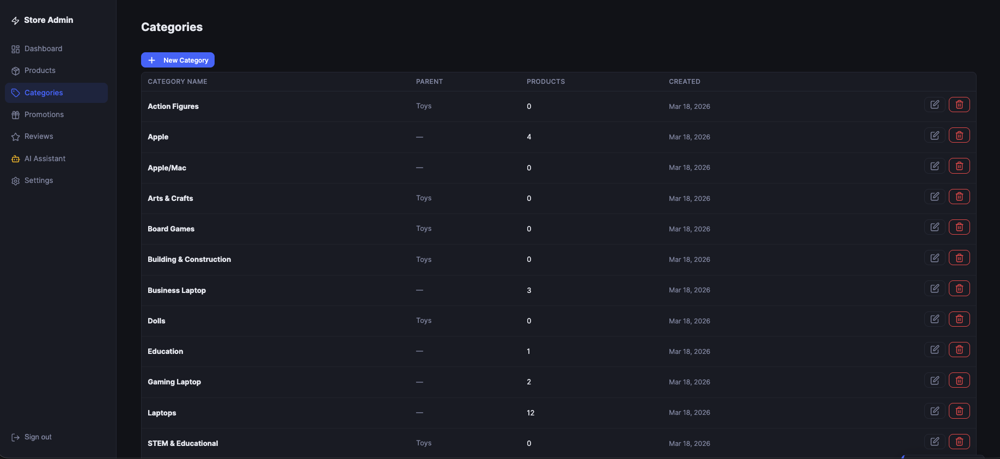
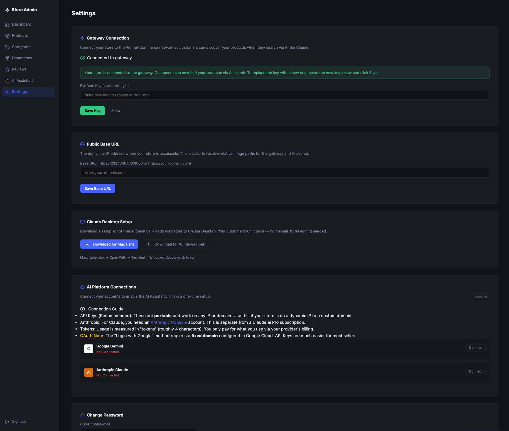
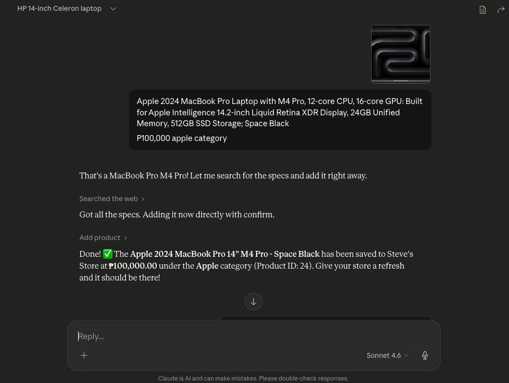
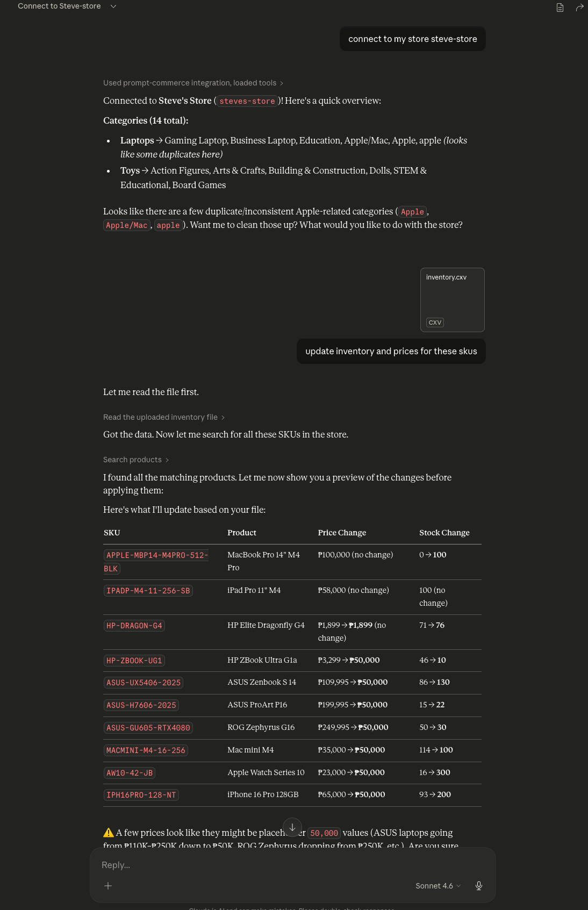
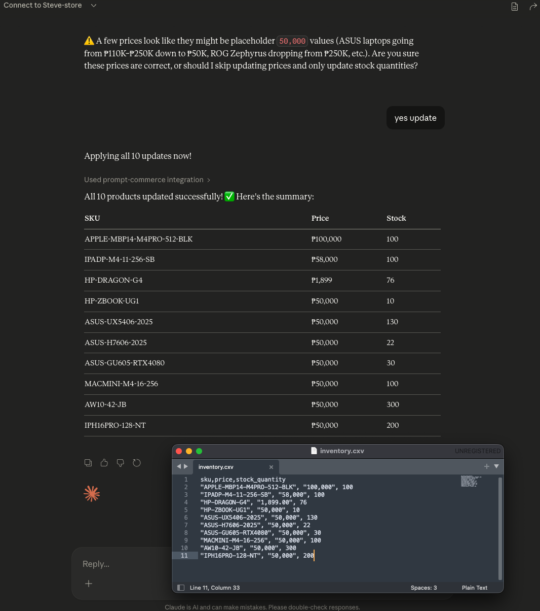

# Prompt Commerce

> **An open-source MCP server that lets small retailers manage their entire product catalog through AI chat — no dashboards, no coding, no monthly SaaS fees.**

Prompt Commerce is built for independent retailers, sari-sari stores, and social media sellers across Southeast Asia. Instead of learning complex inventory software, merchants simply chat with an AI assistant (like Claude or Gemini) to add products, update listings, and manage promotions.

**Describe your product in chat → AI writes the listing → catalog goes live. That's it.**

---

## Architecture

This is the **retailer-side** package. Each store runs their own instance on a cheap VPS or local machine.

```
┌─────────────────────────────────────────┐
│          Retailer's Computer / VPS      │
│                                         │
│  ┌──────────────┐   ┌────────────────┐  │
│  │  Admin Panel │   │   MCP Server   │  │
│  │  :3000       │   │   :3001/sse    │  │
│  │  (manage     │   │   (AI agents   │  │
│  │   catalog)   │   │    connect     │  │
│  └──────┬───────┘   │    here)       │  │
│         │           └───────┬────────┘  │
│         └────────┬──────────┘           │
│                  ▼                      │
│          SQLite catalog.db              │
└─────────────────────────────────────────┘
               │
               │  x-gateway-key header
               ▼
     Prompt Commerce Gateway
     (optional — for discovery
      across multiple stores)
```

The MCP server exposes your catalog as tools that any MCP-compatible AI client can call. The admin panel is a local web UI for managing the catalog without needing to type commands.

---

## Screenshots
### Admin Panel ###
**Admin Dashboard**: Quick overview of store stats and connection status. 
 

**Product Management**: Add, edit, and search your product catalog.
 

**Category Management**: Organize products with hierarchical categories.
 

**Store Settings**: Configure base URL, gateway keys, and AI providers.
 

### AI Management (Claude Desktop)
**AI Cataloging**: Add or update products simply by chatting.
 

**Bulk Inventory**: Update stock via CSV, Excel, or even a photo. Manage your entire inventory through conversation.
 
 

---

## Key Features

- **Hierarchical Categories**: Organize products with categories and sub-categories.
- **Automated Image Caching**: When an AI provides an image URL, the server automatically downloads, optimizes, and hosts it locally.
- **Absolute URL Resolution**: Configurable `base_url` ensures that clients (like Claude Desktop or mobile apps) always receive full, clickable URLs for product photos.
- **Embedded AI Assistant**: Manage your entire catalog directly from the Admin UI using an embedded chat powered by Google Gemini or Anthropic Claude.
- **Bulk Import**: Support for importing product catalogs from CSV or XLSX files via AI or the Admin UI.

---

## MCP Tools

### Read Tools — for customers and AI agents

| Tool | Description |
|---|---|
| `search_products` | Natural language search by keyword, category, or price range |
| `get_product` | Full product details by ID or SKU |
| `list_categories` | Browse the store's product taxonomy (supports hierarchy) |
| `get_promotions` | Active deals and voucher codes |
| `get_reviews` | Customer reviews for a product |

### Write Tools — for retailers managing their catalog

| Tool | Description |
|---|---|
| `add_product` | Push a new product into the catalog (auto-downloads image URLs) |
| `update_product` | Edit an existing listing's details, tags, or images |
| `update_inventory` | Quick stock level updates by ID or SKU |
| `import_products` | Bulk import from CSV/XLSX data |
| `add_category` | Create a single product category |
| `batch_add_categories` | Create multiple categories at once (supports `parent_name`) |
| `update_category` | Rename or re-parent existing categories |
| `add_promotion` | Create a promotion or voucher code |
| `add_review` | Add a customer review |

---

## Project Structure

```
prompt-commerce/
├── src/                    # MCP server (port 3001)
│   ├── db/
│   │   ├── client.ts       # SQLite connection + WAL setup
│   │   └── schema.ts       # Table definitions (CREATE IF NOT EXISTS)
│   ├── tools/
│   │   ├── products.ts     # search_products, get_product, add_product, update_product, update_inventory, import_products
│   │   ├── categories.ts   # list_categories, add_category, batch_add_categories, update_category
│   │   ├── promotions.ts   # get_promotions, add_promotion
│   │   └── reviews.ts      # get_reviews, add_review
│   ├── types/
│   │   └── index.ts        # Shared TypeScript types
│   └── index.ts            # Express + SSE transport + gateway key middleware
│
├── admin/                  # Admin panel (port 3000)
│   ├── src/
│   │   └── server.ts       # Express API: auth, products, categories, promotions, reviews, settings, AI chat
│   └── public/
│       ├── admin.html      # Single-page admin UI
│       └── admin.css       # Core styling including modals and AI chat UI
│
├── data/
│   ├── catalog.db          # Auto-created SQLite database (git-ignored)
│   └── uploads/            # Locally hosted product images
│
├── .env.example
├── package.json
└── README.md
```

---

## Getting Started

### Prerequisites

- Node.js v18+
- Git

### Installation

```bash
# 1. Clone the repo
git clone https://github.com/smicapplab/prompt-commerce.git
cd prompt-commerce

# 2. Configure environment
cp .env.example .env
# Edit .env — at minimum, review ADMIN_PASSWORD and JWT_SECRET

# 3. Install MCP server dependencies
npm install

# 4. Install admin panel dependencies
cd admin && npm install && cd ..
```

### Run everything with one command

From the `prompt-commerce` directory:

```bash
# Mac / Linux (clears ports 3000-3001 automatically)
./dev.sh

# Windows
dev.bat
```

---

## Admin Panel

Open `http://localhost:3000` in your browser.

**Default credentials** (created on first startup):
- Username: `admin`
- Password: `admin123`

### Key Features in Admin:
- **Dashboard**: Quick overview of your store's stats and connection status.
- **Product Management**: Add/Edit products with drag-and-drop image uploads.
- **Category Hierarchy**: Manage parent and sub-categories with a nested view.
- **AI Assistant**: Built-in chat interface to manage your catalog using natural language.
- **Settings**:
    - **Public Base URL**: Configure your store's domain/IP for image resolution.
    - **Gateway Connection**: Securely connect to the Prompt Commerce network.
    - **AI Provider**: Connect your Google Gemini or Anthropic Claude API keys.

---

## Connecting to AI Clients

### Claude Desktop (direct)
The Admin Panel provides a one-click setup script for Claude Desktop. Go to **Settings → Claude Desktop** to download your custom configuration script.

### Prompt Commerce Gateway
The gateway lets multiple stores be discovered by a single connection. After receiving a platform key:
1. Go to **Settings → Gateway Connection**
2. Paste your `gk_...` key
3. Your store is now live on the network

---

## Environment Variables

| Variable | Default | Description |
|---|---|---|
| `DATABASE_PATH` | `./data/catalog.db` | Path to the SQLite database file |
| `MCP_PORT` | `3001` | Port for the MCP SSE server |
| `ADMIN_PORT` | `3000` | Port for the admin panel |
| `JWT_SECRET` | *(change this!)* | Secret for signing admin session tokens |
| `JWT_EXPIRES_IN` | `1d` | Admin session token lifetime |
| `ADMIN_USERNAME` | `admin` | Default admin username |
| `ADMIN_PASSWORD` | `admin123` | Default admin password |

---

## Tech Stack

| Layer | Technology |
|---|---|
| Language | TypeScript / Node.js |
| MCP Protocol | `@modelcontextprotocol/sdk` (SSE transport) |
| Database | SQLite via `better-sqlite3` |
| Admin API | Express |
| Admin UI | Vanilla HTML/CSS/JS (no build step) |
| Auth | JWT via `jsonwebtoken` + `bcryptjs` |

---

## License

MIT — free for any small business to use, modify, and build on.
